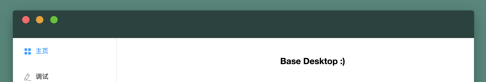
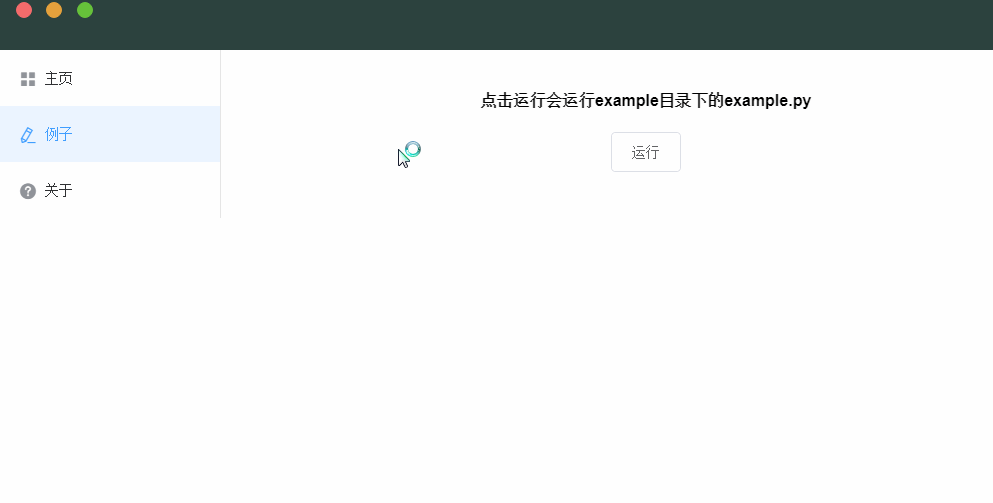

# Base Desktop App

> electron + vue + element UI = excellent desktop app

[](https://github.com/prettier/prettier)

为你的工具快速构建一个界面



## 写在前面（2020.6.6）

- 这个项目已经是两年前的东西了，两年可以改变的事情太多，何况是在日日新的前端。所以你会看到很多依赖可能会报deprecated的warning，但暂时不影响使用；
- 需要注意，element ui目前的维护积极性已经不太高，vue也会逐渐往3切换；
- 这套设计本质上反映了一个概念是，利用electron构建桌面，用terminal/cli来作为交互中介，与backend交互；
- 这很明显会导致的问题就是它与系统的耦合依旧过高，你需要自行处理诸如路径之类的问题；
- 如果你希望构建一个认真的app，我更推荐你参考 [传统的client/server概念](https://github.com/fyears/electron-python-example)，但很遗憾这个库也已经被弃用了；
- 我不是专职的前端工程师，编写这个项目也只是做一个概念设计，我更希望你能从中得到一些概念上的启发，带着自己的思考去设计更好的程序；
- 当然，这并不代表这个库不能用，如果你只是想构建小工具，那么它也是一个选择；
- Have fun :)

## 目的

- 在日常工作中，经常需要开发一些小工具用于简化流程以提升开发效率
- 这些小工具通常都比较零碎，需要一个有效的手段将他们聚合在一起，这种手段通常是GUI
- 而GUI的开发是很繁琐的，如果投入很多时间到开发GUI上难免本末倒置。而语言原生的GUI通常都非常丑
- 这套模板针对这种情况被设计出来

## 选型

- electron 将前端技术应用到桌面应用的开发中，利用前端技术开发桌面应用成为可能
- vue 大大降低了前端入门门槛，让其他方向的工程师也能够快速上手
- element UI 作为vue系列中知名的组件库，让工程师也能够独立开发出美观的界面
- node 环境提供了与系统交互的能力，能够整合其他已有的工具

## 设计

- 标题栏仿照MacOS制作，在全平台上表现一致
- 美观的加载动画与通知弹窗，可以根据需要进行定制
- 使用方法尽量简单，让开发者能够把更多的精力放在工具本身而不是GUI上

## 使用

建议是直接fork到自己的github使用，然后就可以随便玩了（？

### 安装依赖

``` bash
npm install
```

### 运行

在环境配置完毕之后，执行：

```
npm run dev
```

如果环境没有错误的话，应该可以看到app已经被正常拉起了。

### 如何关联现有的工具

首先我们需要新增一个页面：

- 在pages中新增vue文件，例如新增一个example模块：
    - 创建example文件夹
    - 在里面创建Example.vue文件
- 在components/SideBar.vue中仿照其他项目新增
    - `<el-menu-item index="/example"><i class="el-icon-edit"></i>例子</el-menu-item>`
- 在router/index.js中仿照其他项目新增
    - `{path: '/example', component: 'Example'},`

这样就可以看到在侧边栏中已经有新增的项目了。

假设我们需要加入的是一个 python 脚本（比如放置在根目录的 example文件夹 中），你只需要在 `Example.vue` 下新增方法：

```js
this.$execCmd(
    // 命令行怎么运行它就怎么写
    `python ./example/example.py`,
    // 加载动效的文字
    "运行python example :)",
    // 结果存放，如果按默认设定，在执行完成后： 
    // `this['cmdResult'] = result`
    'cmdResult',
)
```

然后点击运行：



就可以啦！

## 依赖项目

- [Electron](https://electronjs.org)
- [Vue](https://cn.vuejs.org)
- [ElementUI](http://element.eleme.io/#/zh-CN)

## BUG与建议

欢迎issue。（也欢迎star/fork
